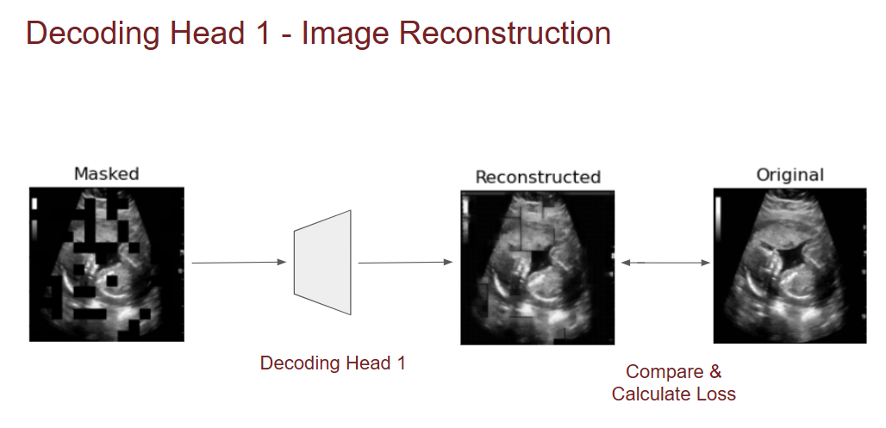
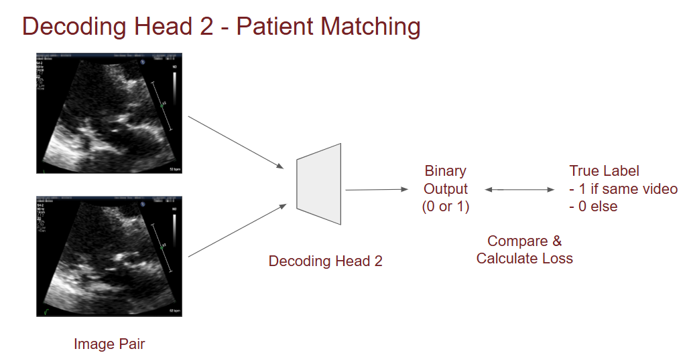
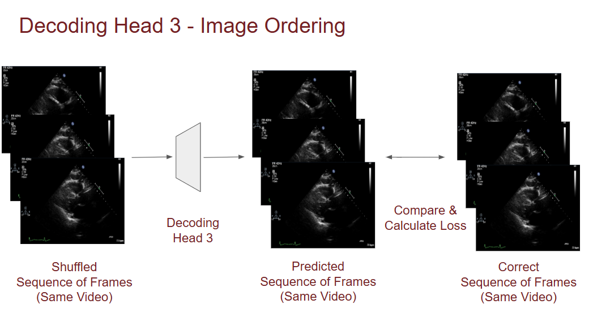

# Ultrasound Image Encoder

An ultrasound image encoder pretrained in a self-supervised, multi-task setting, combining masked image reconstruction (MIR), patient matching (PM), and image ordering (IO) to learn meaningful representations without manual labels.

## 🚀 Overview

This project implements a ResNet-based encoder trained on ultrasound frames using three self-supervised pretext tasks:

- **MIR**: Reconstruct masked regions of an image (VAE-style)
- **PM**: Predict whether two images are from the same video of a patient
- **IO**: Predict the correct temporal order of shuffled frame sequences

## 📂 Project Structure

```text
ultrasound-image-encoder/
│
├── dataset.py              # Dataset class and masking logic
├── model.py                # Multi-head encoder model
├── training.py             # Multi-task training loop
├── utils.py                # Loss functions
├── main.py                 # Entry point for training
└── README.md
```

## 🛠️ Setup

### 1. Install dependencies

Install required packages:

```bash
pip install torch torchvision pandas numpy pillow tqdm
```

### 2. Prepare data

Ensure that you have a `.csv` file containing all the following columns:

- `frame_path`: path to the image file  
- `patient_id`: patient identifier
- `video_name`: unique video/sequence ID
- `frame_id`: frame identifier


## 📈 Training Workflow

### 1. Configuration Setup
Edit `config.py` to specify your paths and parameters:

```python
data_path = 'path/to/your/data' # CSV file as described above
checkpoint_path = 'path/to/save/checkpoints' # Directory for model outputs
```

### 2. Launch Training
Execute the training script with:

```bash
python main.py 
```

## 🧠 Pretext Tasks

| Task | Description | Loss Function | Head Architecture |
|------|-------------|---------------|-------------------|
| **MIR** | Masked image reconstruction | MSE + KL divergence | Variational autoencoder |
| **PM** | Patient matching from image pairs | Binary cross-entropy | 2-layer MLP on pair features |
| **IO** | Frame sequence ordering | Cross-entropy | 1-layer MLP on concatenated features |

### Key Features:

#### MIR (Masked Image Reconstruction)
  
Learns spatial features by reconstructing masked image regions  

#### PM (Patient Matching)
  
Develops patient-specific representations through image pairing  

#### IO (Frame Sequence Ordering)
  
Captures temporal dynamics via sequence ordering  

## 📄 License

This project is licensed under the [MIT License](LICENSE) © 2025 Ippokratis.

